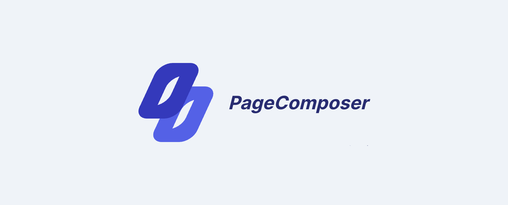

# PageComposer



**Handle your content a little differently**

This package aims to create a flexible CMS experience for the user as well as the developer. Content is divided into rows and columns which contain elements of your choosing, text, photo, video and elements you can create based on your needs. This is a different approach at handling website content. I hope you like it.

### Docs

- [Installation](#installation)
- [Dependency configuration](#dependency-configuration)
- [Laravel layout](#laravel-layout)
- [Livewire](#livewire)
- [Configuration](#configuration)
- [Laravel compatibility](#laravel-compatibility)

## Installation

### Install package

Add the package in your composer.json by executing the command.

```bash
composer require flobbos/page-composer
```

PageComposer features auto discover for Laravel. In case this fails, just add the
Service Provider to the app.php file.

```
Flobbos\PageComposer\PageComposerServiceProvider::class,
```

### Running the installation routine

Using the new install command you are guided through the process of publishing all necessary files as well
as set up all required directories and symlinks.

```bash
php artisan page-composer:install
```

Follow the step by step process or alternatively you can just run everything at once. There is a prompt
for that option.

### Publish configuration file

This step is very important because it publishes the NewsletterTemplate model
to the App folder so you can set your own fillable fields as well as
relationships you may need. The template generator needs to have this model
present otherwise you will receive an error.

This also publishes the inital base layout that will be used to generate
newsletter templates.

```bash
php artisan vendor:publish --tag=page-composer-config
```

Here you need to use the route previously defined for your controller. The default
is the same but you will also be asked during the generation process.

### Dependency configuration

The package relies on flobbos/translatable-db to handle translations. It's important
to configure this package as well. For this you need to run:

```bash
php artisan vendor:publish
```

Select the Flobbos\TranslatableDb package. It will publish a configuration file to
which you need to add the following path:

```php
'language_model' => 'Flobbos\PageComposer\Models\Language',
```

This way the language model will be detected correctly and translations can be loaded.

Please also check the [Livewire](#livewire) section for two very important config settings
to make things work correctly.

Additionally you will need to add the package views to your TailwindCSS configuration
so everything is compiled correctly. In the contents section of the config file please
add the following line:

```php
"./vendor/flobbos/page-composer/src/resources/views/*.blade.php",
```

This will let Tailwind know where to look for files to check for classnames and such.

### Laravel layout

PageComposer injects a few snippets onto the scripts stack in order to make the default components work like the editor for example. For this to work correctly you need to add the following to your default layout:

```php
@stack('scripts')
```

Either at the top or bottom of your layout file.

### Migrations

During the publishing process the migration for the newsletter_templates table
was also published. Add all fields you need and run the migration.

```bash
php artisan migrate
```

### Adding the package

### Routes

The routes will be automatically loaded from the package folder. However you may need to update
the middlewares being used on these routes. You can do this easily by editing the config like so:

```php
'middleware' => [
        'web',
        'auth:sanctum',
        config('jetstream.auth_session'),
        'verified',
    ]
```

In this example we have Laravel Jetstream installed with the default configuration.

### Menu entries

There's no default menu provided with the package. You need to add these entries yourself.
The following routes must be added to access the PageComposer:

```php
route('page-composer::pages.index');
route('page-composer::pages.create');
route('page-composer::pages.edit',$page_id);
```

If you want to use the default preview route, you need to add the following route:

```php
route('page-composer::pages.detail',$page_id);
```

There's also a built in micro bug tracker for users of the package. There users can
report bugs or add wishes for new elements and such.

```php
route('page-composer::dashboard');
```

## Configuration

The configuration options have been kept fairly simple at the moment. The following
options are available:

### Validation rules

Here you can set some basic validation options that will be used for saving a page.

```php
'rules' => [
        'page.name' => 'required', //mandatory
        'page.photo' => 'required',
        'page.slider_image' => 'sometimes:image',
        'page.newsletter_image' => 'sometimes:image',
        'pageTranslations.*.content.title' => 'required', //mandatory
        'page.category_id' => 'required', //remove if not using categories
    ],
```

### FAQ

There's a small FAQ to help people get started. If you want to show this:

```php
   'showFaq' => true,
```

### Tags

If you want to use the tags provided by the package for the pages created:

```php
    'useTags' => true,
```

### Categories

PageComposer comes with a default categorisation option. If you want to use it:

```php
    'useCategories' => true,
```

### Element Creator

PageComposer provides stubs for creating new content elements. These will of course
just create a blank element template which you need to update. This option might be a
bit counter intuitive for the regular users if made available during production.

```php
    'showElementCreator' => true,
```

## Livewire

The package relies on Livewire 3 and Alpine 3. There are a few options you need to change to make things work.

### Legacy model binding

The option for binding directly to an Eloquent model has been removed in Livewire 3
by default. PageComposer heavily relies on this feature since it was initially created
with Livewire 2. This will change in the future but the for moment you need to enable
this feature for things to work.

```php
'legacy_model_binding' => true,
```

### Layout

All full page components use the classic layout path which differs from the default
layout path suggested by Livewire 3. Set the folling option for the correct layout path:

```php
'layout' => 'layouts.app',
```

## Laravel compatibility

| Laravel | LaravelCM |
| :------ | :-------- |
| 11.x    | >0.0.1\*  |
| 10.x    | >0.0.1\*  |

Lower versions of Laravel are not supported.
